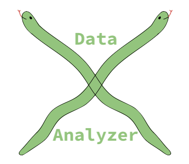
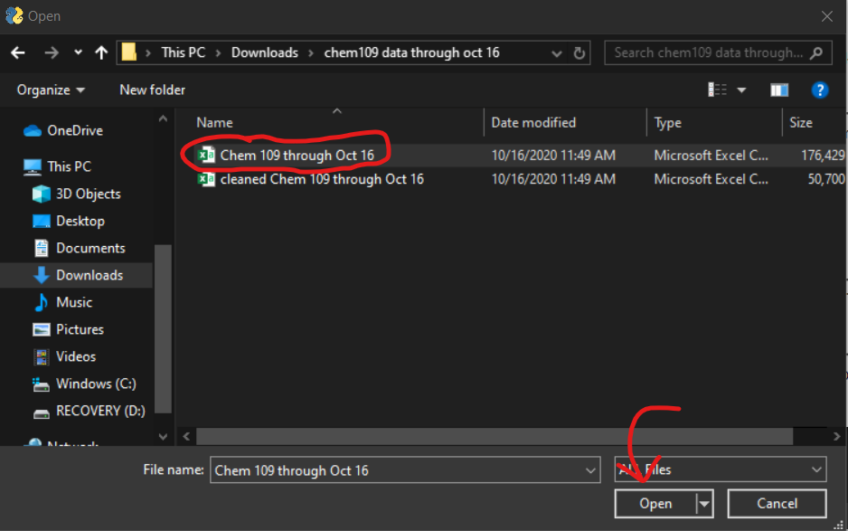
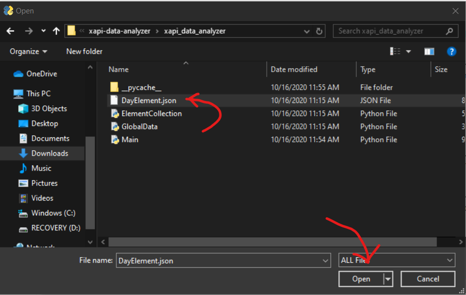
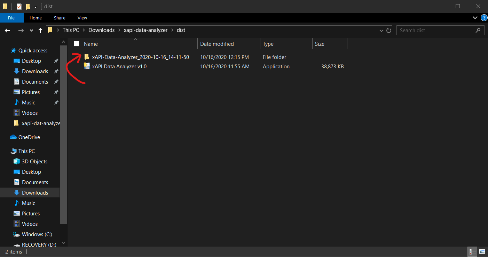

# xapi-data-analyzer


This program was originally created by Walt Boettge and Harrison White, working under Dr. John Moore at the University 
of Wisconsin-Madison Department of Chemistry.

It was created with the goal of parsing and analyzing xAPI data created from H5P elements embedded within the CHEM 109 
Pressbooks online textbook. The program relies on the data being present as an exported .csv file from the UW-Madison 
Learning Locker (in the "raw" format).


## Installation
### For users:
Simply download the latest `xAPI-Data-Analyzer.exe` file and double-click it to launch the program. 

You may get a popup from Windows on your first launch warning about a potential security risk -- this is because the 
.exe is not signed by a registered Microsoft developer. Always exercise caution when running any unknown executables, 
but if you trust the source of the executable, proceed to run it.

### For developers: 
Clone the repository and navigate to the root directory.

To use the program, simply run `xapi_data_analyzer/Main.py`. The program depends on the following libraries, which must be installed for it to run:

* `pandas`
* `pysimplegui`
* `matplotlib`
* `jsonschema`

#### Creating an executable
To create an executable, install PyInstaller (`pip install pyinstaller`) and run the following command in the project's
root directory:

`pyinstaller -wF --add-data xapi_data_analyzer\DayElementSchema.json;. -i images\icon.ico -n xAPI-Data-Analyzer_vX.X xapi_data_analyzer\Main.py`

This will create a standalone executable file named `xAPI-Data-Analyzer_vX.X` in the `dist` folder under the current directory 
(for whatever operating system you run the command on). This allows end users to run your program without having Python 
or any of the third-party libraries installed!

Do note that PyInstaller only works with up to Python 3.7. There is also currently a bug between the latest version of matplotlib
and PyInstaller, so you need to have matplotlib 3.0.3 installed (`pip install matplotlib==3.0.3`) to successfully create an exe.


## Usage
### Data CSV input
The first thing the program asks you to do is to select the .csv file containing the raw data from the DoIT Learning Locker.
Click the top "Browse" button and select the appropriate file.




The program is designed for this data to be cumulative, although any section of data works.

#### A note on data format
The program looks for the following columns in the spreadsheet (in any order):

* `Email`
    * contains email addresses prefaced by `mailto:`
* `Verb`
    * contains H5P ID verbs, such as "interacted", "answered", etc
* `object id`
    * contains web links to H5P elements
* `Question/Slide`
    * contains names of H5P elements
* `Timestamp`
    * contains standard-format timestamps of interactions
* `Duration`
    * contains the seconds that someone spends interacting with an element (unreliable, but can still be helpful)

The raw data *should* already be in an appropriate format, but it's important to note that **the tool requires that these columns
exist with these exact names!**

### JSON input
Next, click the second "Browse" button and select the provided `DayElement.json` file. This file automatically tells the program
which H5P IDs correspond to which "Days" in the CHEM 109 curriculum, so the program can output data grouped by Day. It also
contains information on the configurable `TimeDelta` input. More information is included below about the `DayElement.json` file.




### Selecting the data to be analyzed
The program now presents a choice: data can be analyzed by Day or by H5P ID. Grouping by Day is most convenient if you'd 
like all of the data in the spreadsheet analyzed or you know the specific Days you'd like analyzed. Grouping by H5P ID is best
if you'd like only the H5P elements you enter to be analyzed and nothing more.

#### Analyzing data by Day
To analyze data by Day, enter the Day numbers you would like analyzed as a comma-separated list in the first text input box.
To analyze every Day that has data, type `all` into the box.

**FIXME add scrots**

If you choose this method, leave the second text input box blank.

#### For advanced users: analyzing data with a custom H5P ID list
If you know the exact H5P IDs you want data on, enter their numbers as a comma-separated list into the second text input box.


If you choose this method, leave the first text input box blank.

### Running the tool
After you either enter Day numbers or H5P IDs, press the green "Go" button to run the program.


Depending on the size of the data .csv, the tool may take a couple minutes to run.

After the program finishes, a popup will appear informing you that the data has been successfully analyzed.

The program saves all of the CSVs and graphs in a folder titled `xAPI-Data-Analyzer_$TIMESTAMP/`, which resides in the
directory that you executed the program. If you used the JSON input, there will be a folder for each Day within the main folder,
and each Day folder will contain a csv for the Day's data and student durations, as well as corresponding graphs saved as PNGs.
If you input your own list, the main folder will just contain one data csv, one student durations csv, and the corresponding graphs.



Note: the timestamp is generated based on Central Time (US).

### Output
For each day chosen, or for the group of IDs selected, two .csv files will be generated.
`DayX.csv` (or `ElementCollection.csv` if using an IDList) includes one row per H5P element.
Associated with each element is
* The objectID (elementID)
* The Element Name
    * If the element name cannot be found, this will be left blank
* A list of students who interacted with the element
    * If a student generated an xAPI statement with this element and with any verb besides `consumed` they appear in this list
* The number of students who interacted
* The percentage of all students who interacted
    * All students being defined as every email present in the data (after filtering emails)
    
`StudentDurations.csv` has one row per student who made some interaction with the chapter.
Associated with each student is
* The student's email
* The students total duration for the given day
    * This is calculated by computing the total time in between each interaction. Gaps larger than `Time_Delta` (more info about this below) are ignored.

### The DayElement.json File
This file contains required configuration information.
The file has data regarding which emails to filter, the 'time_delta', and each textbook chapter.
The schema can be found DayElementSchema.json, and more detail is also included below.
A sample DayElement.json file is included in the repository.
#### Filter_Emails
Schema:
```
"Filter_Emails": {
  "type": "array",
  "description": "A list of emails to ignore (i.e. non-student emails).",
  "items": {
    "description": "An email",
    "type": "string"
  }
}
```
Example:
```
  "Filter_Emails": [
    "professor@wisc.edu", "dev@wisc.edu", "TA@wisc.edu"
  ],
``` 
#### Time_Delta
When calculating the time a student spends on a given Day, a 'Time Delta' parameter is used.
This is the max time in between interactions that a student can be considered actively reading the chapter.
For example, a student might interact with an H5P element at 12:00, and then interact with another element at 12:20.
If Time Delta is set to 10 minutes, we assume the student took a break in between interactions, and their total duration
does not change. If Time Delta is instead 30 minutes, their total duration would increase by 20 minutes.

Schema:
```
"Time_Delta": {
  "description": "A number of minutes that defines a max duration in between interactions that a student is considered still engaged with the reading",
  "type": "integer",
  "min": 1
},
```
Example:  
`"Time_Delta": 30,`

#### Days
This list contains data about each Day relevant to the analysis.  
Schema:
```
"Days": {
  "description": "A list of day objects containing relevant info such as the title and H5P elements present",
  "properties": {
    "Day_XX": {
      "properties": {
        "Title": {
          "description": "The name of the chapter",
          "type": "string"
        },
        "DayNumber": {
          "description": "The Day Number",
          "type": "integer",
          "min": 1
        },
        "Unit": {
          "description": "The unit this day is a part of",
          "type": "integer",
          "min": 1
        },
        "Elements": {
          "description": "A list of the H5P elementIDs found in the chapter",
          "type": "array",
          "items": {
            "description": "An H5P ElementID",
            "type": "integer",
            "min": 1
          }
        }
      }
    }
  }
}
```
Example (for 2 days):
```
"Days":{
  "Day_1": {
    "Title": "Chemistry, Matter, Energy, Models",
    "DayNumber": 1,
    "Unit": 1,
    "Elements": [
    308, 311, 313, 209, 106
    ]
  },
  "Day_2": {
    "Title": "Atomic Spectra and Atomic Orbitals",
    "DayNumber": 2,
    "Unit": 1,
    "Elements": [
    219, 213, 218, 23, 212, 22, 21, 226, 223, 224, 353, 216, 350, 354, 414, 415
    ]
  }, ...
}
```


## License
This package is licensed under the MIT License. The full license text is available in LICENSE in the root directory.
